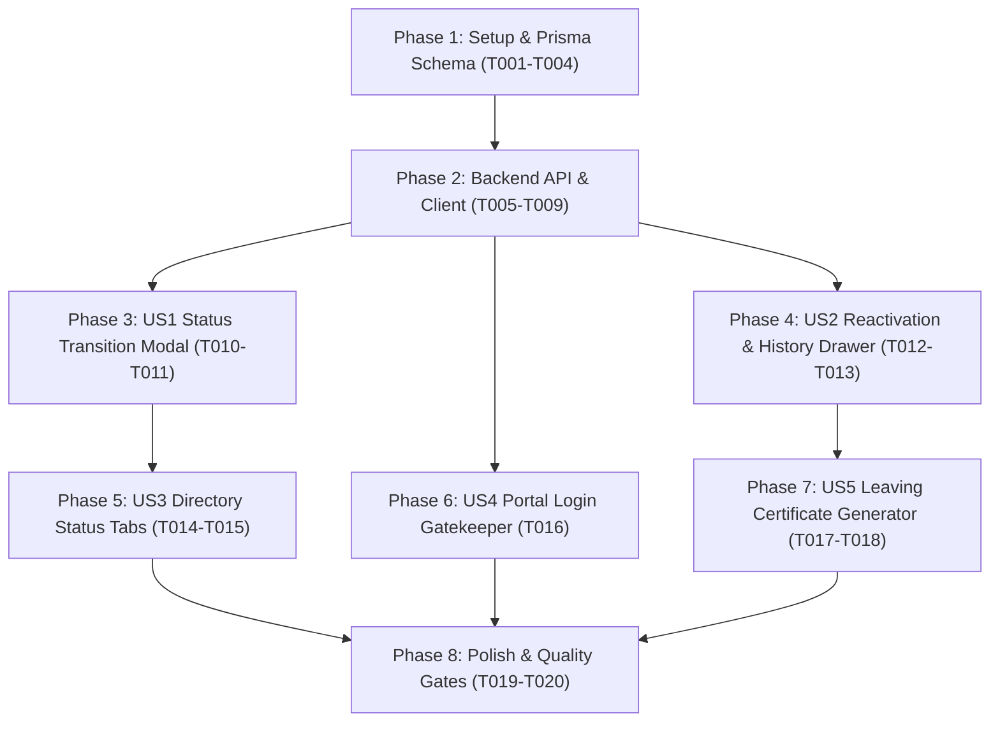

# Tasks: Student Status Lifecycle & Retention Management

**Input**: Design documents from `specs/006-student-status-lifecycle-management/`  
**Prerequisites**: [plan.md](./plan.md) (required), [spec.md](./spec.md) (required), [research.md](./research.md), [data-model.md](./data-model.md), [contracts/api-contracts.md](./contracts/api-contracts.md)

---

## Format: `[ID] [P?] [Story] Description`

- **[P]**: Can run in parallel (different files, no dependencies)
- **[Story]**: Which user story this task belongs to (`US1`, `US2`, `US3`, `US4`, `US5`)
- Clear file paths included in every task

---

## Phase 1: Setup (Database & Shared Types)

**Purpose**: Schema additions, database synchronization, and foundational TypeScript contracts.

- [x] T001 Update `server/prisma/schema.prisma` to add `StudentStatusHistory` model and extended lifecycle status fields (`status`, `status_reason`, `status_remarks`, `status_updated_at`, `leaving_date`, `is_fee_paused`) on the `Student` model.
- [x] T002 Run `npx prisma generate` and `npx prisma db push` to synchronize Prisma client and Supabase PostgreSQL database.
- [x] T003 [P] Add TypeScript interfaces (`StudentLifecycleStatus`, `StatusReasonCategory`, `StudentStatusHistoryItem`, `LeavingCertificateData`) in `src/types.ts`.
- [x] T004 [P] Seed baseline status transition history data in `server/prisma/seed.ts`.

---

## Phase 2: Foundational (Backend REST Endpoints & API Client)

**Purpose**: Core API endpoints and client communication methods.

- [x] T005 Implement Zod validation schema and `POST /api/v1/students/:id/status` endpoint in `server/src/routes.ts` (modifies status, sets fee pause flag, logs transition in `StudentStatusHistory` and `AuditLog`).
- [x] T006 [P] Implement `GET /api/v1/students/:id/status-history` endpoint in `server/src/routes.ts` to return the chronological transition timeline for a student.
- [x] T007 [P] Implement `POST /api/v1/students/:id/reactivate` endpoint in `server/src/routes.ts` to restore inactive/left students with optional batch assignment.
- [x] T008 [P] Implement `GET /api/v1/students/:id/leaving-certificate` endpoint in `server/src/routes.ts` to compute attendance score, fee clearance indicator, and exit certificate payload.
- [x] T009 Implement API client methods (`changeStudentStatus`, `getStudentStatusHistory`, `reactivateStudent`, `getLeavingCertificate`) in `src/api/apiClient.ts`.

---

## Phase 3: User Story 1 - Comprehensive Status Transitions & Fee Policies (Priority: P1) 🎯 MVP

**Goal**: Enable administrators to change student status between Active, Inactive/On Leave, Suspended, Graduated, and Left with reason logging and fee pause options.  
**Independent Test**: Change student status from Active to Inactive with reason "Medical Leave", verify status updates in UI, fee generation pauses, and transition history is created.

- [x] T010 [US1] Create `src/components/ChangeStudentStatusModal.tsx` adhering to Floating Island Modal Architecture (Navy `#0F172A` header island, white form card island with target status, reason category, effective date, remarks, fee action toggles, and floating action pills).
- [x] T011 [US1] Wire `ChangeStudentStatusModal` into `src/pages/StudentsView.tsx` row action menu (`•••` More Actions) and status badge click triggers.

---

## Phase 4: User Story 2 - 1-Click Reactivation & Status Audit Timeline (Priority: P1)

**Goal**: Provide 1-click student reinstatement and embed a full chronological status history timeline inside the 360° profile drawer.  
**Independent Test**: Open an inactive student's profile drawer, view past transition timeline in the Status & History tab, click "Reactivate Student", and verify student returns to active status with restored access.

- [x] T012 [US2] Update `src/components/StudentProfileDrawer.tsx` to add a dedicated **Status & History** timeline tab rendering all past status changes with timestamps, admin author names, reason badges, and remarks.
- [x] T013 [US2] Add 1-click `Reactivate Student` action to `src/pages/StudentsView.tsx` with target batch selection and confirmation dialog.

---

## Phase 5: User Story 3 - Directory Status Segmentation & Filter Tabs (Priority: P2)

**Goal**: Segment students directory into clean filter tabs (`All`, `Active`, `On Leave`, `Suspended`, `Alumni`, `Archived / Left`) with live count badges and color-coded status pills.  
**Independent Test**: Toggle between `Active`, `On Leave`, and `Archived / Left` tabs in the Students Directory and verify that each tab filters records accurately without losing access to historical data.

- [x] T014 [US3] Update `src/pages/StudentsView.tsx` segmented filter tabs to include `All`, `Active`, `On Leave`, `Suspended`, `Alumni`, and `Archived / Left` with live count badges and single-line status pills.
- [x] T015 [US3] Update mobile card roster in `src/pages/StudentsView.tsx` to render status badges, leave reason tags, and mobile quick action menus.

---

## Phase 6: User Story 4 - Parent & Student Portal Access Gating (Priority: P2)

**Goal**: Automatically gate student and parent mobile web portal access when student is inactive or suspended.  
**Independent Test**: Attempt login with credentials of an inactive/suspended student and confirm login is blocked with an informative administrative guidance banner.

- [x] T016 [US4] Update portal authentication logic in `server/src/routes.ts` to verify student status upon login and return user-friendly status restriction feedback for non-active accounts.

---

## Phase 7: User Story 5 - Official Leaving Certificate & Clearance Generator (Priority: P3)

**Goal**: Generate official institutional Leaving Certificate and Clearance Slip with attendance rate, fee clearance status, conduct rating, print layout, and WhatsApp dispatch.  
**Independent Test**: Open any graduated or left student, select "Leaving Certificate", preview certificate with clearance details, click "Send WhatsApp" and "Print Slip".

- [x] T017 [US5] Create `src/components/LeavingCertificateModal.tsx` using Floating Island layout with print-ready styling, fee clearance indicators, conduct ratings, principal signature line, and 1-click **Send WhatsApp** / **Print Slip** buttons.
- [x] T018 [US5] Connect `LeavingCertificateModal` trigger in `src/pages/StudentsView.tsx` row action menu and `src/components/StudentProfileDrawer.tsx`.

---

## Phase 8: Polish & Cross-Cutting Quality Assurance

**Purpose**: Type checks, responsive UI audit, and end-to-end verification.

- [x] T019 [P] Run TypeScript compiler verification `npx tsc --noEmit` across client and server.
- [x] T020 Execute end-to-end validation scenarios from `specs/006-student-status-lifecycle-management/quickstart.md`.

---

## Dependencies & Execution Order

---

## Implementation Strategy

1. **MVP Scope**: Complete Phase 1 (Schema), Phase 2 (Backend API), and Phase 3 (Status Transition Modal).
2. **Incremental Enhancements**: Add Status History Drawer (US2), Directory Segmented Tabs (US3), Portal Access Gating (US4), and Leaving Certificate Generator (US5).
3. **Quality Gate**: Verify compliance against Constitution Principle IV (Floating Island Modals & UI Standards) and pass `tsc --noEmit`.
