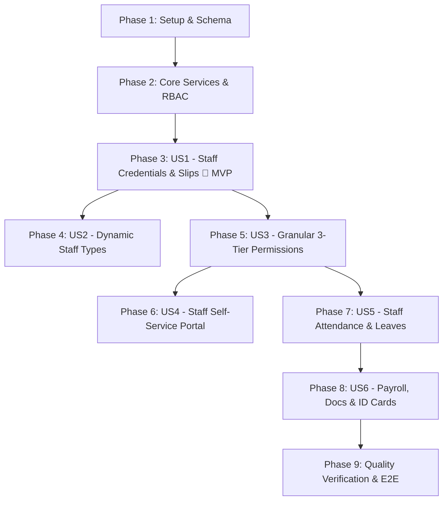

# Tasks: Staff Portal Authentication, Dynamic Roles & Granular Permission Management

**Input**: Design documents from `/specs/008-staff-portal-auth-permissions/`
**Prerequisites**: `plan.md`, `spec.md`, `data-model.md`, `contracts/staff-api.yaml`, `quickstart.md`
**Organization**: Tasks are grouped by user story (P1, P2, P3) to enable independent implementation and testing of each story.

## Format: `[ID] [P?] [Story] Description`

- **[P]**: Can run in parallel (different files, no dependencies)
- **[Story]**: Which user story this task belongs to (e.g., US1, US2, US3)
- Include exact file paths in descriptions

---

## Phase 1: Setup & Data Model Foundation

**Purpose**: Database schema expansion and initial seed data for staff management.

- [ ] T001 Extend Prisma schema with `StaffType`, `StaffMember`, `StaffPermission`, `StaffAttendance`, `StaffLeaveRequest`, and `StaffDocument` models in `server/prisma/schema.prisma`
- [ ] T002 [P] Update database schema via Prisma migration or push in `server/prisma/schema.prisma`
- [ ] T003 Seed default staff types (`Faculty`, `Admin`, `Domestic Staff`) with standard permission presets in `server/prisma/seed.ts`
- [ ] T004 [P] Define core TypeScript interfaces (`StaffMember`, `StaffType`, `StaffPermission`, `StaffAttendance`, `StaffLeaveRequest`, `StaffDocument`) in `src/types.ts`

---

## Phase 2: Foundational Architecture & Core Services

**Purpose**: Backend service layer, RBAC middleware, and frontend API client methods blocking all user stories.

- [ ] T005 Implement `StaffService` business logic (credential generator, staff type CRUD, permission mapping) in `server/src/services/staffService.ts`
- [ ] T006 [P] Implement granular module permission and data scoping middleware (`assertStaffPermission`, `assertOwnBatch`) in `server/src/middleware/rbacMiddleware.ts`
- [ ] T007 Register base REST endpoints (`/api/v1/staff`, `/api/v1/staff-types`, `/api/v1/staff-leaves`) in `server/src/routes.ts`
- [ ] T008 [P] Add strongly typed staff and permissions API client methods in `src/api/apiClient.ts`

---

## Phase 3: User Story 1 - Automated Staff Credential Generation & Credential Slips (Priority: P1) 🎯 MVP

**Goal**: Automatically generate unique Staff IDs and temporary passwords upon staff registration, and render an official floating island Credential Slip modal with Print, PDF, and WhatsApp sharing.

**Independent Test**: Register a new staff member under the Teachers/Staff directory, verify instant optimistic UI update, and confirm the Credential Slip modal displays valid login credentials with functional Print and WhatsApp actions.

- [ ] T009 [P] [US1] Create `StaffCredentialSlipModal.tsx` implementing Floating Island architecture with Print, PDF download, and direct WhatsApp sharing in `src/components/StaffCredentialSlipModal.tsx`
- [ ] T010 [US1] Create `RegisterStaffModal.tsx` with profile info, staff type selection, designation, and auto-credential trigger in `src/components/RegisterStaffModal.tsx`
- [ ] T011 [US1] Implement staff registration backend endpoint (`POST /api/v1/staff`) returning credential payload in `server/src/routes.ts`
- [ ] T012 [US1] Implement Admin one-click password reset endpoint (`POST /api/v1/staff/:id/reset-password`) in `server/src/routes.ts`
- [ ] T013 [US1] Integrate `RegisterStaffModal` and `StaffCredentialSlipModal` into the Teachers & Staff directory in `src/pages/TeachersStaffPage.tsx`

**Checkpoint**: User Story 1 (MVP) is fully functional. New staff can be registered with auto-generated credentials and printable slips.

---

## Phase 4: User Story 2 - Dynamic Staff Type Categorization & Management (Priority: P1)

**Goal**: Allow Administrators to define, customize, and archive custom Staff Types (e.g. Librarian, IT Coordinator, Security Guard) alongside default types.

**Independent Test**: Navigate to the directory tools, create a new staff type "Librarian", verify it appears in the registration dropdown and filter tabs, and assign a staff member to it.

- [ ] T014 [P] [US2] Create `StaffTypeManagerModal.tsx` floating island modal for creating and editing custom staff categories in `src/components/StaffTypeManagerModal.tsx`
- [ ] T015 [US2] Implement Staff Types CRUD endpoints (`GET /api/v1/staff-types`, `POST /api/v1/staff-types`, `PUT /api/v1/staff-types/:id`) in `server/src/routes.ts`
- [ ] T016 [US2] Add category filter tabs (`All`, `Faculty`, `Admin`, `Domestic Staff`, `Custom Types`) to the directory header in `src/pages/TeachersStaffPage.tsx`
- [ ] T017 [US2] Integrate `StaffTypeManagerModal` into the `[ ⚙ Tools ▾ ]` header dropdown in `src/pages/TeachersStaffPage.tsx`

**Checkpoint**: User Stories 1 and 2 work seamlessly together with dynamic staff categorization.

---

## Phase 5: User Story 3 - Granular Role-Based Permissions & Module Visibility Control (Priority: P1)

**Goal**: Provide a 3-tier permission matrix (`Hidden`, `View Only`, `Editable`) per module, enforce classroom data scoping for Faculty, and dynamically adapt navigation.

**Independent Test**: Set a staff member's `Fee Billing` permission to `Hidden` and `Student Directory` to `View Only`, log in with their credentials, and verify that the Fees module is absent and student mutation buttons are disabled.

- [ ] T018 [P] [US3] Create `StaffPermissionsModal.tsx` floating island matrix for toggling 3-tier module access levels in `src/components/StaffPermissionsModal.tsx`
- [ ] T019 [US3] Implement permissions retrieval and update endpoints (`GET /api/v1/staff/:id/permissions`, `PUT /api/v1/staff/:id/permissions`) in `server/src/routes.ts`
- [ ] T020 [US3] Enforce backend data scoping filters on students, attendance, homework, and marks based on assigned batches in `server/src/services/staffService.ts`
- [ ] T021 [US3] Update sidebar navigation and route guards to conditionally render modules based on active staff permissions in `src/components/Sidebar.tsx` and `src/App.tsx`
- [ ] T022 [US3] Add `Configure Permissions` action to staff table row actions menu in `src/pages/TeachersStaffPage.tsx`

**Checkpoint**: Granular 3-tier permissions and scoped classroom access are strictly enforced across frontend and backend.

---

## Phase 6: User Story 4 - Staff Self-Service Portal & Dedicated Dashboard (Priority: P2)

**Goal**: Empower staff members to log in with their Staff ID and view their personalized daily schedule, notices, and quick classroom actions.

**Independent Test**: Log into the staff portal with `FAC-2026-001`, verify personal schedule loads today's assigned batches, and click through to mark classroom attendance.

- [ ] T023 [P] [US4] Implement staff login endpoint (`POST /api/v1/auth/staff-login`) supporting Staff ID or email with JWT issuance in `server/src/routes.ts`
- [ ] T024 [US4] Create role-adapted Staff Dashboard widget displaying today's schedule, assigned batches, and quick action cards in `src/components/StaffDashboardView.tsx`
- [ ] T025 [US4] Implement staff personal profile and password update modal in `src/components/StaffProfileSettingsModal.tsx`

---

## Phase 7: User Story 5 - Staff Attendance & Leave Management Workflow (Priority: P2)

**Goal**: Support daily employee check-in/check-out tracking and an employee leave application workflow with automated substitute teacher prompts upon approval.

**Independent Test**: Submit a leave request from a faculty account, approve it as Admin, and verify the `SubstituteTeacherModal` prompts and successfully reallocates substitute coverage.

- [ ] T026 [P] [US5] Create `StaffLeaveRequestModal.tsx` for submitting leave applications with date ranges and categories in `src/components/StaffLeaveRequestModal.tsx`
- [ ] T027 [P] [US5] Create `SubstituteTeacherModal.tsx` floating island dialog to assign substitute teachers for affected batches in `src/components/SubstituteTeacherModal.tsx`
- [ ] T028 [US5] Implement Staff Attendance and Leave endpoints (`/api/v1/staff-attendance`, `/api/v1/staff-leaves`, `/api/v1/staff-leaves/:id/decision`) in `server/src/routes.ts`
- [ ] T029 [US5] Integrate Leave Approval queue and Staff Attendance register tab in `src/pages/TeachersStaffPage.tsx`

---

## Phase 8: User Story 6 - Staff Payroll Structure, Document Vault & Digital Staff Cards (Priority: P3)

**Goal**: Maintain comprehensive staff profiles with compensation terms (base pay, hourly rate), digital document vault (CNIC, degrees), and printable CR80 identity cards.

**Independent Test**: Open a staff profile drawer, configure salary terms, upload a qualification certificate, and click `Print ID Card` to generate a standardized employee badge.

- [ ] T030 [P] [US6] Create `StaffDetailDrawer.tsx` comprehensive profile drawer with Overview, Schedule, Salary Terms, and Document Vault tabs in `src/components/StaffDetailDrawer.tsx`
- [ ] T031 [US6] Implement staff document upload and salary update endpoints (`POST /api/v1/staff/:id/documents`, `PUT /api/v1/staff/:id/salary`) in `server/src/routes.ts`
- [ ] T032 [P] [US6] Create `StaffIdCardModal.tsx` standardized printable CR80 digital employee badge in `src/components/StaffIdCardModal.tsx`
- [ ] T033 [US6] Integrate Staff Detail Drawer and ID Card trigger into row actions in `src/pages/TeachersStaffPage.tsx`

---

## Phase 9: Polish & Cross-Cutting Quality Verification

**Purpose**: UI/UX taste audit, non-breaking backward compatibility, and automated validation.

- [ ] T034 [P] Audit all staff modals for strict compliance with Floating Island architecture (transparent canvas, dark navy header island, white card island, floating pill action island)
- [ ] T035 [P] Audit entire staff module for zero Unicode emojis and ensure uniform slate Lucide SVG icon styling
- [ ] T036 Verify zero layout jump on interactive buttons and 0ms optimistic UI reflection across all tables and drawers
- [ ] T037 Run TypeScript compilation checks (`tsc --noEmit`) and Vite build verification (`npm run build`)
- [ ] T038 Execute Playwright E2E smoke tests covering staff registration, credential slip generation, and permission enforcement

---

## Dependencies & Execution Order

### Parallel Execution Opportunities:
- **Phase 1**: `T002` (Schema Migration) and `T004` (TypeScript Interfaces) can run in parallel.
- **Phase 2**: `T006` (RBAC Middleware) and `T008` (API Client Methods) can run in parallel.
- **Phase 3 (MVP)**: `T009` (`StaffCredentialSlipModal`) and `T010` (`RegisterStaffModal`) can be built in parallel.
- **Phase 4 & 5**: Once Phase 3 is completed, Custom Staff Types (`US2`) and Permissions Matrix (`US3`) can be developed concurrently.
- **Phase 7 & 8**: `StaffLeaveRequestModal`, `SubstituteTeacherModal`, and `StaffIdCardModal` can be built concurrently.

---

## Implementation Strategy: MVP First (User Story 1)

1. **Step 1**: Complete **Phase 1** (Schema extension & types) + **Phase 2** (Service layer & routes).
2. **Step 2**: Implement **Phase 3 (User Story 1)**: `RegisterStaffModal` + auto-generated ID/password + `StaffCredentialSlipModal` with Print & WhatsApp actions.
3. **Step 3**: Validate MVP independently.
4. **Step 4**: Deliver subsequent phases incrementally (**US2** Staff Types → **US3** Permissions → **US5** Attendance & Leaves → **US6** Documents & ID Cards).
