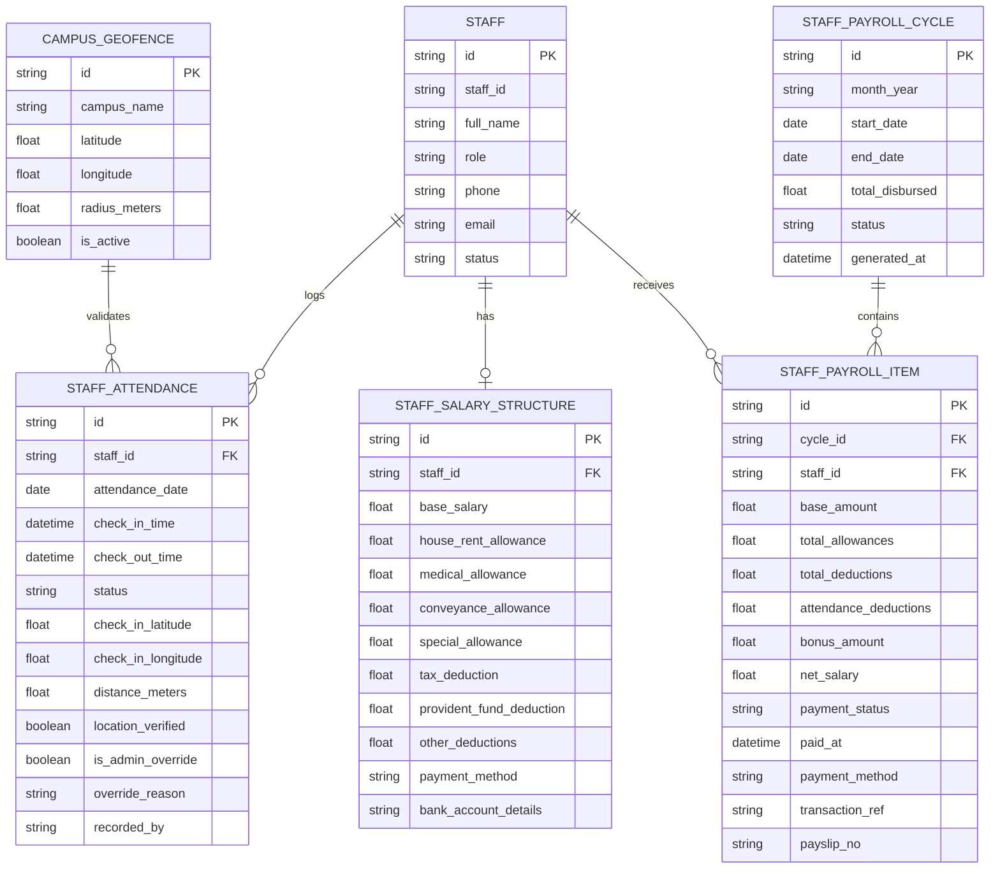

# Feature Specification: Enterprise Staff Payroll Management & GPS Geolocation-Based Attendance with Admin Override

**Feature Branch**: `009-staff-payroll-geolocation-attendance`  
**Created**: 2026-08-25  
**Status**: Draft  
**Input**: User prompt: "search box is not right search icon and text is mixing up payroll option is very basic not real payroll management for staff also there is no attendance system for staff i want google map geo location base attendcance system admin can set the geo location and staff only mark in the geo location attendance but in any other case admin can override that attendace status"

## Clarifications

### Session 2026-08-25
- Q: How should the system determine and classify a staff member's arrival status (e.g., On-Time vs Late) when they clock in via GPS? → A: Shift-Based with Grace Period (15-min grace window compares arrival against scheduled shift; arrivals past grace threshold automatically flag as Late with audit logs).
- Q: How should daily attendance deductions (for unexcused absences or excess late arrivals) be computed during monthly batch payroll generation? → A: Pro-Rata Daily Rate with Admin Override (auto-deducts Base Salary / Days in Month per unexcused absence, with Administrator override capability before disbursement).

---

## 1. Executive Summary & Core Value Proposition

Academic institutions rely on dedicated faculty, administration, and support staff. This specification introduces two mission-critical, enterprise-grade capabilities to Academy Pro OS:
1. **Real Enterprise Staff Payroll Management**: A comprehensive financial compensation engine covering customized salary structures (Base, Allowances, Deductions, Bonuses, Advance Repayments), 1-click batch monthly payroll generation, digital payslips (Print/PDF/WhatsApp), and multi-method disbursement tracking.
2. **GPS Geolocation & Geofenced Staff Attendance**: A secure attendance gateway where Administrators configure the institution's physical GPS coordinates and boundary radius. Staff can clock in/out via browser/mobile GPS only when physically present within the verified perimeter, while Administrators retain complete authority to review GPS audit logs and manually override attendance records in exceptional scenarios.
3. **UI Polish**: Resolved the search input icon and text overlap issue across the directory view.

---

## 2. User Scenarios & Acceptance Criteria *(Mandatory)*

### User Story 1 - Institution Geolocation & Geofence Perimeter Setup (Priority: P1)

**As an** Academy Administrator,  
**I want to** configure the exact GPS location (latitude, longitude, campus name) and allowable geofence radius (e.g., 50m, 100m, 200m) for our campus(es),  
**So that** employee attendance can be objectively validated against physical on-site presence.

**Why this priority**: Without an active institution geofence, geolocation validation cannot compute proximity or prevent off-site buddy punching.

**Acceptance Scenarios**:
1. **Given** an Administrator is in Settings or the Staff Attendance management view, **When** they open "Configure Campus Geofence", **Then** they can either click "Capture Current GPS Location" or manually enter Latitude, Longitude, and Radius (in meters).
2. **Given** the campus coordinates are set, **When** the Admin inputs a radius (e.g. 150m), **Then** an interactive preview card shows the verified campus center, address, and allowable accuracy tolerance.
3. **Given** an academy with multiple campuses/branches, **When** geofences are configured, **Then** staff assigned to specific branches are automatically validated against their respective branch perimeter.

---

### User Story 2 - Staff Geolocation Check-In & Check-Out Verification (Priority: P1)

**As a** Staff Member (Faculty, Admin, Support Staff),  
**I want to** mark my daily attendance (Check-In / Check-Out) from my phone or laptop,  
**So that** my arrival time, departure time, and verified presence are recorded accurately in the institutional register.

**Why this priority**: Ensures staff have a seamless, zero-friction method to clock in daily while guaranteeing operational integrity.

**Acceptance Scenarios**:
1. **Given** a staff member is physically inside the academy campus (distance $\le$ radius), **When** they click "Mark Attendance (Check In)", **Then** the browser captures GPS coordinates, calculates distance via the Haversine formula, confirms verified presence, and records status as `Present` (or `Late` if past cutoff) with exact timestamp and GPS distance.
2. **Given** a staff member attempts to clock in from home or outside the campus (distance $>$ radius, e.g. 800m away), **When** they click "Mark Attendance", **Then** the check-in is blocked with an informative alert (*"You are 800m away from campus perimeter. Attendance can only be marked within the verified 150m radius"*).
3. **Given** a device with location permissions disabled, **When** clicking Check In, **Then** the UI politely guides the user on how to enable browser/device location services.
4. **Given** an active checked-in staff member at the end of their shift, **When** they click "Check Out", **Then** the system logs the departure timestamp, computes total daily working hours, and marks the shift complete.

---

### User Story 3 - Administrative Attendance Oversight & Manual Override (Priority: P1)

**As an** Administrator,  
**I want to** review live daily attendance logs, view GPS verification badges/coordinates, and manually override or adjust any staff member's attendance record,  
**So that** institutional exceptions (device failure, outdoor school trips, official duty, approved leaves, biometric sync) are handled smoothly without penalizing employees.

**Why this priority**: Essential for operational flexibility; real-world environments require authorized administrative overrides.

**Acceptance Scenarios**:
1. **Given** the Staff Attendance Daily Roster, **When** viewing attendance records, **Then** each row displays Staff Name, ID, Check-in Time, Check-out Time, Status Badge (`Present`, `Late`, `Half-Day`, `Absent`, `On Leave`), GPS Status (`Verified On-Site (24m)`, `Manual Override`, `Remote`), and Actions.
2. **Given** a staff member whose phone battery died or was on official off-campus duty, **When** the Admin clicks "Override Attendance", **Then** a floating island modal allows setting status (`Present`, `Late`, `Excused`, `On Duty`), custom time, and an optional Override Reason / Remarks note.
3. **Given** an attendance override is submitted, **When** the log is saved, **Then** the record updates instantly (0ms optimistic) with an `[ Admin Override: Reason ]` audit tag and the Admin user ID.

---

### User Story 4 - Comprehensive Staff Salary Structure Definition (Priority: P1)

**As an** Administrator or HR/Finance Officer,  
**I want to** configure a tailored salary structure for each staff member,  
**So that** recurring monthly compensation accurately reflects their contract, allowances, tax, and deductions.

**Why this priority**: Replaces arbitrary flat salary numbers with transparent, auditable itemized remuneration.

**Acceptance Scenarios**:
1. **Given** the Staff Profile or Salary Configuration modal, **When** editing an employee's remuneration, **Then** the Admin can define:
   - **Base Monthly Salary (PKR)**
   - **Allowances**: House Rent, Medical, Travel/Conveyance, Special / Dearness Allowance
   - **Standard Deductions**: Income Tax, EOBI / Provident Fund, Health Insurance
   - **Payment Details**: Preferred Payment Method (Bank Transfer, Cash, Cheque) and Bank Account / IBAN details.
2. **Given** changes to salary components, **When** amounts are typed, **Then** a live Gross Salary and Net Payable preview updates in real time.

---

### User Story 5 - Monthly Batch Payroll Generation & Disbursement (Priority: P1)

**As a** Finance Manager,  
**I want to** generate monthly payroll for all active staff in one click, automatically calculating deductions for unpaid absences/late penalties, and recording disbursements,  
**So that** payroll processing is automated, accurate, and completely auditable.

**Why this priority**: Eliminates manual spreadsheet calculations and prevents payroll errors across large academic teams.

**Acceptance Scenarios**:
1. **Given** the Payroll Management View for a specific month (e.g. August 2026), **When** the Admin clicks "Generate Monthly Payroll", **Then** the system computes for every active staff member:
   - Total Gross Earnings (Base + Itemized Allowances + Bonuses)
   - Attendance-based Deductions (calculated from unexcused absences and leave records)
   - Advances / Deductions Repayments
   - Net Payable Salary
2. **Given** generated payroll items, **When** clicking "Disburse Salary", **Then** a payment voucher is recorded with payment method, transaction reference, date, and changes status to `Paid` (or `Partial`).
3. **Given** a paid salary record, **When** clicking "Payslip", **Then** a formal, institutional Payslip is generated with academy branding, itemized earnings, deductions breakdown, net pay, and one-click `[ 🖨️ Print Payslip ]`, `[ ⤓ PDF ]`, and `[ 💬 WhatsApp Dispatch ]`.

---

## 3. Data Model & Entity Relationships

---

## 4. Measurable Success Criteria

1. **Geolocation Accuracy**: 100% of staff check-ins capture device GPS coordinates and calculate radial distance against the configured campus perimeter within $< 1$ second.
2. **Geofence Enforcement**: Zero unauthorized off-site check-ins allowed when distance exceeds the configured radius ($> \text{radius}$ meters).
3. **Override Flexibility**: Administrators can override any attendance status in $< 3$ clicks with instant optimistic UI reflection and audit logging.
4. **Payroll Precision**: 1-click batch monthly payroll computes itemized earnings, allowances, attendance deductions, and net salaries for 50+ staff in $< 2$ seconds with mathematical consistency ($\text{Net} = \text{Gross} - \text{Deductions}$).
5. **Zero Emojis & Theme Standard**: 100% adherence to `.agents/AGENTS.md` (Floating Island Modals, Lucide SVG icons, zero Unicode emojis, non-jumping 1.5px borders, zero-delay optimistic state updates).
